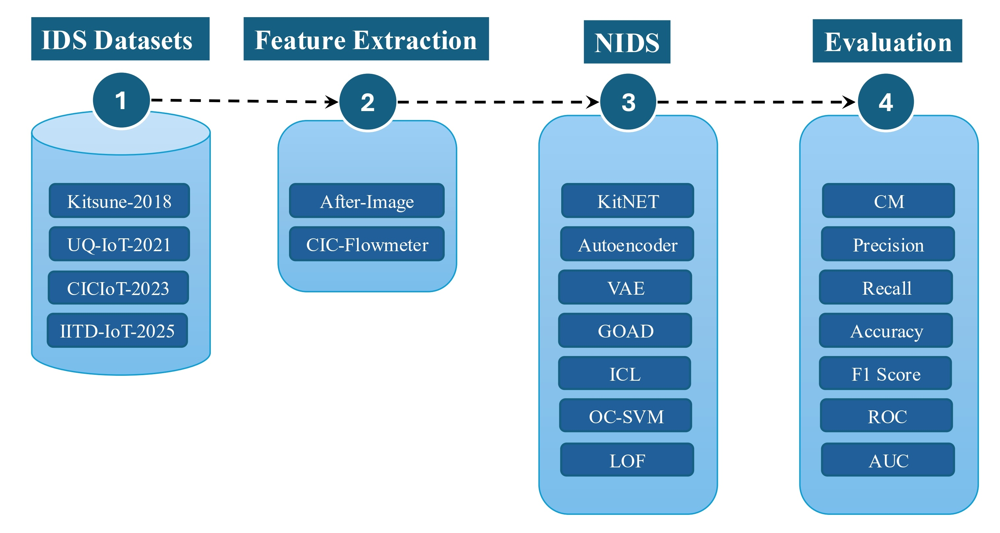

Titli Documentation
===================

**Titli** is a comprehensive toolkit for hosting feature extraction, model training, model inference, 
and model evaluation of AI-based Intrusion Detection Systems (IDS).

|

.. image:: https://img.shields.io/pypi/pyversions/titli
   :alt: PyPI - Python Version

.. image:: https://img.shields.io/pypi/v/titli
   :alt: PyPI - Version

.. image:: https://img.shields.io/github/license/spg-iitd/titli
   :alt: GitHub License

Overview
--------

Titli provides a modular framework for building and evaluating intrusion detection systems. It includes:

* **Feature Extractors**: Tools for extracting features from network traffic (e.g., AfterImage)
* **IDS Models**: Various anomaly detection models (Kitsune, LOF, OCSVM, VAE, etc.)
* **Utilities**: Helper functions for data processing, loss computation, and more

Table of Contents
-----------------

.. toctree::
   :maxdepth: 2
   :caption: User Guide

   installation
   quickstart
   usage

.. toctree::
   :maxdepth: 2
   :caption: API Reference

   api/fe
   api/ids
   api/utils

.. toctree::
   :maxdepth: 1
   :caption: Additional Information

   changelog
   license

Indices and tables
==================

* :ref:`genindex`
* :ref:`modindex`
* :ref:`search`
